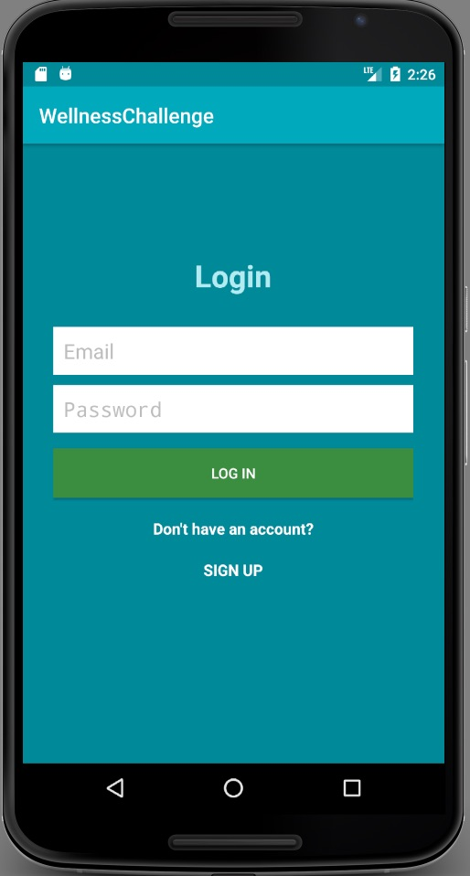
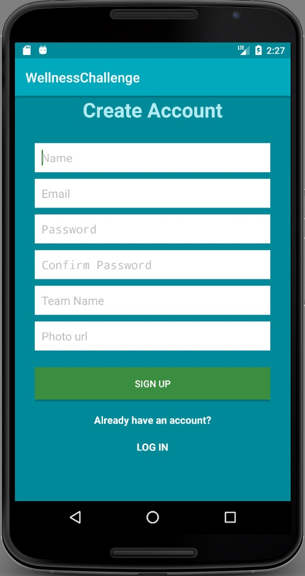
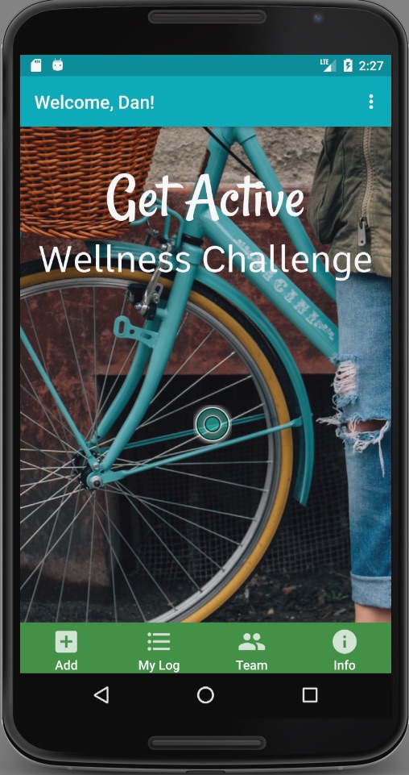
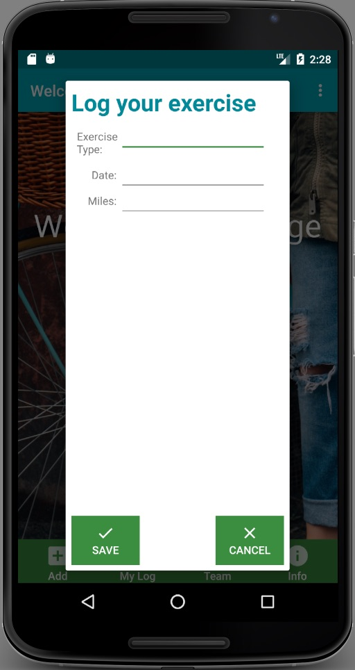
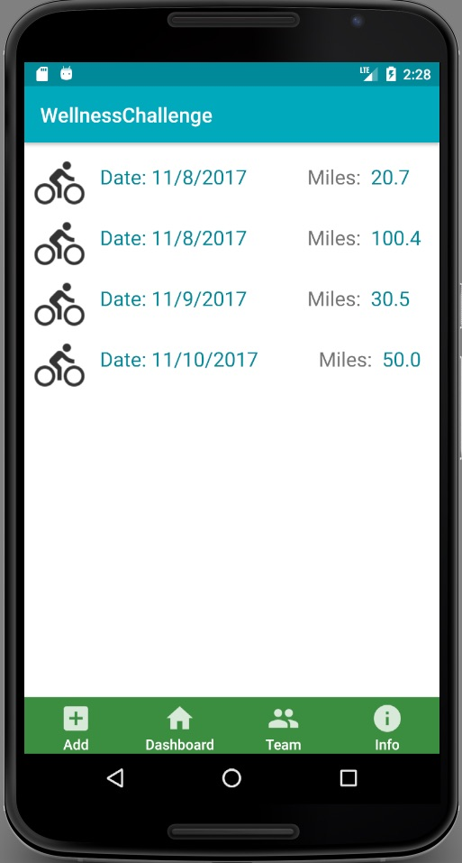
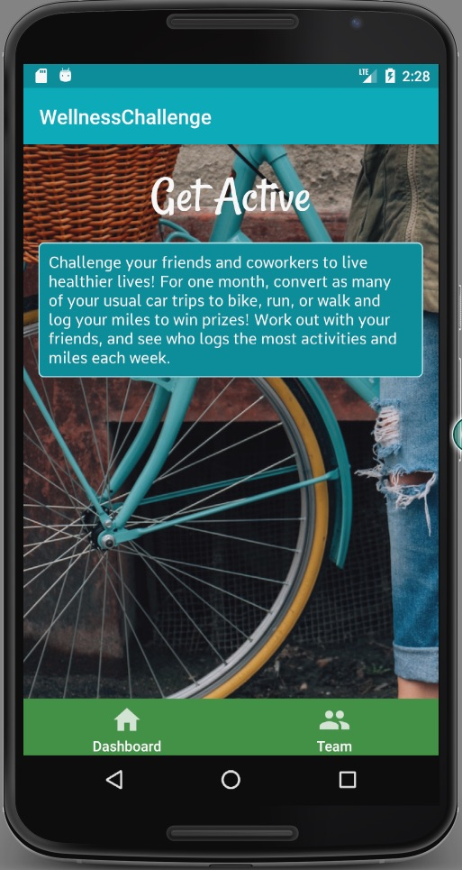

# Community Wellness Challenge App

#### By Esti Shay
#### Android project for Epicodus, Nov. 2017

## Description

Android app for workplace (or community) wellness challenges. Users choose a team, log their activities, and view their teammates' activities.

Workplace wellness challenges frequently pit participants against strangers in other companies or departments. This app is designed to create a team that competes together and against each other so that teammates can cheer each other on and hold each other accountable to not cheat.

Designed for a Nexus 6 running Marshmallow.

## Current Feature in Progress (Jan. 2018)
Exercise icon in log.

## Specifications
#### MVP
* Create an account and choose a team
* Add exercise events to your account: date, type of exercise (bike, run, or walk), and mileage
* View your own exercise events
* View your teammates and each teammate's exercise events
* About section, explaining how to use the app
* Team statistics - who has the most events, most miles that week

#### Future Development
* Reward badges on dashboard - for being active every day in a week; for doubling your activity from one week to the next; for reaching certain mile milestones; for being active at least 3 days every week for the entire challenge; for doing a group activity with teammates (bike to happy hour, afternoon break group walk)
* Messages on dashboard
* Allow users to create their own teams
* Users can send encouragement messages to teammates
* Add fourth field to activity log to list a teammate who encouraged them to do that activity, which results in that teammate getting an extra badge
* Create feature to checkout road conditions before going out for a ride/run

## Design

## Setup/Installation Requirements
* Clone the repo
* Log into Firebase with your Google account: https://firebase.google.com/
* Follow the [Manually add Firebase](https://firebase.google.com/docs/android/setup) instructions in the documentation. Make sure you save the google-services.json to the app directory.

### Technologies Used
* Java, XML
* Android Studio
* Firebase

### Known Bugs
None at present.

### License

Licensed under GPL

Copyright &copy; 2017 Esti Shay
